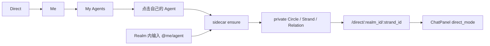

# Inkson Sidecar 与 Circle 界面及功能改进报告

- 状态：提案（待产品、协议与实现评审）
- 日期：2026-07-12
- 范围：Inkson 的 Agent Sidecar、普通 Circle 导航/创建/管理、私密 Strand 体验与诊断能力
- 规范真相源：`arkret-spec/spec/v1/zh/models/circle.md` §11.1、`arkret-spec/spec/v1/zh/sync/service-http-binding.md`

## 1. 执行摘要

当前 Inkson 已经具备 Agent Sidecar 的最小可用链路：用户可以从 `Direct → Me → My Agents` 点击自己的 Agent，或在普通讨论中使用 `@me/<agent>`，客户端随后调用 `POST /_arkret/self/agent-sidecar-threads:ensure` 并进入 `/direct/:realm_id/:strand_id`。

但现有实现只是用 `direct_mode=true` 复用通用 `ChatPanel`，尚未形成可被用户理解和诊断的 Sidecar 产品界面。普通 Circle 方面已有模型、查询 transport、scope banner 和 scope picker 组件，但缺少导航入口、列表页、创建入口、成员管理以及与新建 Strand 的实际接线。唯一会创建 Circle 的 UI 是默认关闭的实验性 “Promote discussion” 流程，而且仍使用错误的 Space 文案。

本报告建议：

1. 把 Sidecar 定义为一种**隐藏于普通 Circle 导航之外的特殊私密工作面**，而不是普通群聊或普通 Circle 页面。
2. 为 Sidecar 增加专用头部、上下文条、成员与 Agent 状态、加密披露和可展开诊断面板。
3. 在 Realm 导航中为普通 Circle 增加独立入口、列表和创建流程，同时严格过滤 `ak.profile.agent_sidecar_thread.v1`。
4. 优先补齐端到端阶段日志和可见状态，使“消息没有回复”能够准确定位在 ensure、membership reconcile、MLS、通知 fanout、Agent 收取、Agent 执行或回复提交中的具体一段。
5. 按 P0–P4 分阶段交付，先解决正确性、隐私和可诊断性，再扩展普通 Circle 管理能力。

## 2. 概念与边界

### 2.1 Realm、Circle、Space 与 Sidecar

| 概念 | 用户含义 | 系统职责 |
|---|---|---|
| Realm | 协作与身份边界 | 成员主源、策略、能力与默认加密边界 |
| Circle | Realm 内更窄的成员与事件作用域 | 子集 membership、投递/查询/projection 裁剪、可选独立 MLS group |
| Space | 导航容器 | 组织页面、Board、List；自身不持有 membership 或密钥 |
| Agent Sidecar | 特殊 Circle profile 下的私密 AI 工作面 | controller 与其 eligible native personal agents 的隔离会话作用域 |

Sidecar 不是“自己和某一个 Agent 的普通 1:1 群聊”。规范规定每个 `(realm_id, controller_id)` 复用一个 sidecar Circle，该 Circle 可以承载多个私有 Strand；Circle membership 是 controller 加该 Realm 中满足 `eligible_sidecar_agent` 的 Agent 闭集。

`addressed_agent_ids` 只决定本次 ensure 后的通知 fanout，不是持久成员边界。因此 UI 必须区分：

- **Sidecar 成员**：当前有资格访问该 Circle 未来内容的 controller 与 eligible agents。
- **本次呼叫的 Agent**：当前消息/上下文实际 addressed 的 Agent。

不应把 “本次呼叫 Savfox” 错误展示成 “只有你和 Savfox 能访问整个 sidecar Circle”。

### 2.2 必须保持的隐私不变量

1. Sidecar Strand 不得出现在 Realm-wide navigation、Board、普通列表、公开搜索、公开 relation expansion 或目标 Strand projection。
2. 普通 Circle 列表、搜索和创建后跳转逻辑必须显式排除 `ak.profile.agent_sidecar_thread.v1`。
3. 非成员不得看到 Sidecar Circle 的存在、名称、成员、消息数量或错误细节。
4. Sidecar 不能加入其他 human actor、外部 service principal、Applet Ghost Actor 或不满足 accountability 的 Agent。
5. 父 Realm 要求 E2EE 时，Sidecar 必须使用 `mls_rfc9420`；允许明文时，UI 必须明确披露“未端到端加密”，不得只显示笼统的“Private”。
6. 新 Agent 获得既有 Sidecar scope 访问权属于高信任动作，pairing/恢复流程必须显式披露并取得可审计确认。

## 3. 当前实现盘点

### 3.1 已存在的 Sidecar 入口和流程



现有代码行为：

- `src/app/mod.rs` 渲染自己的 Agent 列表并在点击时调用 ensure。
- `src/views/chat/composer.rs` 拦截面向自有 Agent 的 mention，保留草稿并切换到私有 composer，避免把消息提交到当前 Realm。
- `src/app/route_surface.rs` 将 `Route::DirectConversation` 映射到通用 `ChatPanel`。
- `direct_mode` 会隐藏左侧 Strand 列表和新建 Strand 弹窗。
- 右侧 Members/Settings、watch level、presence 等仍沿用普通讨论界面；Members 面板默认打开。
- E2E mock 已覆盖 ensure 返回 `private_circle_id`、`private_strand_id` 和 `private_relation_id`，导航测试覆盖点击 Agent 后进入 `/direct/...`。

### 3.2 已存在的 Circle 基础能力

| 能力 | 状态 | 备注 |
|---|---|---|
| `CircleScope` / `CircleSummary` | 已有 | 可表达 Realm scope 与 Circle scope |
| Circle list transport | 已有 | 调用 SDK `circle_list(realm_id)` |
| `CircleScopePicker` | 已有但未挂载 | 组件要求父页面传入已过滤的 eligible Circles |
| `CircleComposerBanner` | 已有 | 已有 Circle-scoped Strand 时可提示可见范围 |
| 消息 Circle accent rail | 已有 | 根据 Strand projection 的 `scope_circle_id` 渲染 |
| confidential discussion banner | 已有 | 可链接公开父 Strand |
| 普通 Circle 导航/列表 | 缺失 | 无 Circle route、侧栏分组或管理页 |
| 普通 Circle 创建 | 缺失 | 无稳定的用户入口 |
| Circle 成员管理 | 缺失 | 无选择、邀请、移除、状态管理界面 |
| archive/restore/tombstone UI | 缺失 | 测试/服务契约不能替代生产界面 |

### 3.3 实验性创建流程的问题

`experimental-discussion-promote` 默认关闭。启用后会顺序构造和提交：

1. `ak.circle.create`
2. Circle-scoped `ak.strand.create`
3. `confidential_discussion_of` relation

当前问题：

- 标题仍写 “Promote discussion to its own Space”。
- 输入标签仍写 “Child Space title”。
- 实际创建的是 Circle 与私密 Strand，不是 Space。
- 没有成员选择或成员边界预览。
- 三个事件顺序提交，用户无法理解中间失败后的状态。
- Circle picker 尚未接入正常的新建 Strand 流程。

## 4. 问题分级

| 级别 | 问题 | 影响 |
|---|---|---|
| P0 | 无端到端阶段状态与关联日志 | 无回复时无法判断故障发生在哪一跳 |
| P0 | Sidecar 加密状态与 membership readiness 不透明 | 用户可能把“私密作用域”误解为“已 E2EE 且 Agent 已能读取” |
| P0 | 通用 Members 面板不表达 Sidecar membership 语义 | addressed Agent、eligible Agent、已加入 MLS 设备容易混淆 |
| P1 | Sidecar 没有专用身份和隐私说明 | 用户无法确认已离开公开 Realm composer |
| P1 | 普通 Circle 与 Sidecar 缺少明确产品边界 | 后续接入 Circle list 时存在误展示风险 |
| P1 | Circle picker 是孤立组件 | 用户不能在正常创建流程选择私密 scope |
| P2 | 没有普通 Circle 入口和创建流程 | Circle 功能对用户事实上不可用 |
| P2 | 实验创建文案把 Circle 叫作 Space | 概念错误，可能导致错误的权限预期 |

## 5. 目标信息架构

### 5.1 全局与 Realm 导航

```text
Direct
├─ Me
│  ├─ Savfox                         → 打开/确保 Sidecar Strand
│  ├─ Coauth Agent                   → 打开/确保 Sidecar Strand
│  └─ Manage my agents               → Agent 管理
└─ Contacts

Realm
├─ Board
├─ Discussion
├─ Circles                           → 仅普通 Circle
│  ├─ Product
│  ├─ Leadership
│  └─ + Create Circle
└─ Members
```

Sidecar 不加入 Realm 的 `Circles` 分组，也不提供“查看所有 Sidecar Circle”的普通目录。用户入口始终从“我拥有的 Agent”或自有 Agent mention 出发。

### 5.2 路由建议

- 保留 `/direct/:realm_id/:strand_id`，避免将私密内部对象暴露为普通 Circle 路由语义。
- 新增普通 Circle 路由，例如：
  - `/realms/:realm_id/circles`
  - `/realms/:realm_id/circles/:circle_id`
  - `/realms/:realm_id/circles/:circle_id/strands/:strand_id`
- 路由解析后仍需服务端 projection 授权；前端隐藏不是安全边界。
- 对 Sidecar profile 的 Circle route 访问应重定向到 `/direct/...` 或返回不泄露存在性的 unavailable 状态，不能渲染普通 Circle 管理页。

## 6. Sidecar 界面设计

### 6.1 主界面

```text
┌──────────────────────────────────────────────────────────────────┐
│ ← Direct   [bot] Savfox                         [🔒 E2EE] [⋯]    │
│            Private AI sidecar · only you and eligible agents     │
├──────────────────────────────────────────────────────────────────┤
│ Context: Facebook / sazz / Discussion                  [Open ↗]  │
│ Addressed now: Savfox · Ready                                    │
├──────────────────────────────────────────────────────────────────┤
│                                                                  │
│  conversation timeline                                           │
│                                                                  │
├──────────────────────────────────────────────────────────────────┤
│ [Agent unavailable: missing MLS KeyPackage] [Repair pairing]      │
│ @Savfox  Ask something…                                  [Send]   │
└──────────────────────────────────────────────────────────────────┘
```

必须具备：

- **专用标题**：Agent 名称 + “Private AI sidecar”，不能只显示普通 Strand 名称。
- **安全徽章**：`E2EE`、`Private but not E2EE` 或 `Preparing encryption`，不能把三者混为一个锁图标。
- **上下文条**：显示 ensure 的 `context_ref` 来源，并提供回到原 Realm/Strand/Message 的入口。
- **本次 addressed 状态**：显示本次真正唤醒的 Agent，而不是把整个 Sidecar member pool 伪装成 1:1。
- **发送前 readiness gate**：membership reconcile 或 MLS 未完成时阻止误导性发送，并提供明确原因和动作。
- **草稿迁移确认**：由 `@me/<agent>` 触发切换时保留原文，并在私密 composer 顶部显示“消息尚未发送”。

### 6.2 成员与访问面板

将通用 Members 面板替换为 Sidecar 专用 Access 面板：

```text
Access
├─ You (controller)                         Active
├─ Savfox (eligible agent)                  Ready · addressed now
├─ Research Agent (eligible agent)          Paused
└─ Encryption
   ├─ Profile                               MLS RFC 9420
   ├─ Membership reconciliation             Complete
   └─ Current device                        Joined
```

规则：

- 只展示调用者有权看到的 Sidecar membership projection。
- 区分 Agent lifecycle、eligibility、Circle membership 和 MLS device membership。
- 不允许在此手工添加 human member。
- Agent pause/deactivate/revoke 后，显示“访问已移除/正在 reconcile”，并禁止继续 addressed。
- 新 Agent 获得既有 scope 访问权时，跳转到独立的高信任确认流程，不能在普通成员列表中静默开启。

### 6.3 状态模型

| UI 状态 | 含义 | 用户动作 |
|---|---|---|
| Opening | 正在 ensure Circle/Strand/Relation | 等待，可取消返回 |
| Reconciling access | eligibility 已确认，membership fanout 尚未完成 | 查看详情/重试 |
| Preparing encryption | MLS membership 或 KeyPackage 未就绪 | 修复配对/补充 KeyPackage |
| Ready | 当前设备可加密，addressed Agent 可接收 | 允许发送 |
| Sent, awaiting Agent receipt | 事件已提交，通知/Agent receipt 尚未确认 | 查看诊断/重试通知 |
| Agent working | Agent 已领取并开始处理 | 停止/等待 |
| Reply submitted | Agent 回复事件已被服务端接受 | 正常显示回复 |
| Agent unavailable | paused、revoked、pairing expired、runtime offline 等 | 显示准确修复入口 |
| Failed safely | 服务端返回不泄露存在性的失败 | 展示通用错误，诊断面板保留安全的本地阶段信息 |

### 6.4 明文 Sidecar 披露

当父 Realm 允许 plaintext 且 Sidecar `encryption_profile=none` 时，头部必须使用明确文案：

> 此 Sidecar 仅通过成员、投递和查询权限隔离，消息未端到端加密。

禁止使用单独的 “Encrypted” 或可能被理解为密码学保护的锁标识。

## 7. 普通 Circle 界面设计

### 7.1 Circle 列表

列表只展示当前用户可见的普通 Circle：

- 标题、图标、颜色。
- active member 数量。
- 加密状态。
- 用户角色与 watch/unread 状态。
- active/archived 状态。
- 最近可见活动，但不得预览无权访问的内容。

客户端收到的 Circle projection 必须先按 profile 分类。Sidecar profile 即使因为服务端缺陷意外出现在普通 list response 中，Inkson 也要 fail closed：不渲染、不索引、不加入搜索，并记录不含敏感 metadata 的 invariant violation。

### 7.2 创建 Circle

建议采用三步 modal/wizard：

1. **基本信息**：名称、short name 预览、图标、颜色。
2. **成员与隐私**：只能从 Realm active members 中选择；实时显示谁可以查看未来内容。
3. **加密与初始内容**：展示 Realm encryption floor，选择允许的加密 profile，可选创建首个 Strand。

提交前确认页必须写清：

- Circle 不是 Space；它改变内容的可见成员边界。
- 未加入 Circle 的 Realm 成员看不到 Circle-scoped 内容。
- MLS Circle 的新成员默认不能获得过去 epoch secrets。
- 创建和成员变更会产生可审计事件。

不得复用 sidecar ensure endpoint 创建普通 Circle，也不得把 self-scoped sidecar capability 解释为普通 `ak.circle.create` 权限。

### 7.3 新建 Strand 的 scope 选择

将现有 `CircleScopePicker` 接入新建 Strand 流程：

```text
Scope
(●) Realm — everyone in this Realm
( ) Product Circle — 8 members
( ) Leadership Circle — 4 members
```

选择 Circle 后：

- 显示 `CircleComposerBanner`。
- 展示准确成员数量与加密状态。
- 提交事件的 canonical envelope 与 payload scope 必须一致。
- 从 Realm-scoped Strand 切换到 Circle-scoped Strand 时使用明确的跨 scope 转场，而不是表现成同一 Strand 内的普通 tab。

### 7.4 私密讨论创建

实验性 Promote 流程应重命名为“创建私密讨论”，并修正文案：

- “Promote discussion to its own Space” → “Create a private Circle discussion”。
- “Child Space title” → “Private discussion title”。
- 创建前增加 Circle 选择：使用已有 Circle，或在有权限时新建 Circle。
- 显示父讨论与私密讨论是两个不同 scope 的 Strand。
- 对多事件提交提供明确的事务结果或可恢复工作流；不能在部分成功时只显示泛化失败。

## 8. 诊断与 Debug 设计

### 8.1 用户可见诊断面板

Sidecar 顶部菜单增加“Connection details”，默认折叠：

```text
Trace ID                 019…
Ensure                   Complete
Circle membership        Complete
MLS membership           Blocked: agent KeyPackage unavailable
Message submit           Not started
Notification fanout      Not started
Agent receipt            Not received
Last updated             10:42:31
```

提供：

- `Copy diagnostic summary`：复制脱敏后的阶段、错误码和 trace ID。
- `Retry safe step`：只重试可幂等的 ensure、reconcile 查询或通知，不重复提交用户消息。
- `Open agent settings`：进入 pairing/key/runtime 状态。
- `Export local logs`：导出受限时间窗口且默认脱敏。

### 8.2 结构化日志字段

Inkson、Soland 与 Savfox 应使用同一个 `trace_id`/`correlation_id` 串联以下阶段：

| 阶段 | 建议事件名 | 必要字段 |
|---|---|---|
| mention 路由 | `sidecar.route.requested` | trace_id、source realm/strand、addressed agent ids |
| ensure 请求 | `sidecar.ensure.started` | controller、context_ref kind、request attempt |
| ensure 返回 | `sidecar.ensure.completed` | circle/strand/relation ids、pending reconciliation count |
| membership | `sidecar.membership.reconciled` | eligible count、joined count、failed count、reason code |
| MLS | `sidecar.mls.readiness` | encryption profile、local joined、agent joined、epoch/commit ref |
| 消息提交 | `sidecar.message.submitted` | event id、idempotency key、accepted frontier |
| 通知 fanout | `sidecar.notification.dispatched` | addressed agent id、dispatch outcome、retry count |
| Agent 收取 | `sidecar.agent.received` | agent id、message event id、runtime instance id |
| Agent 执行 | `sidecar.agent.run.state` | run id、queued/started/completed/failed、reason code |
| 回复提交 | `sidecar.reply.submitted` | agent id、reply event id、parent message id、outcome |
| 客户端同步 | `sidecar.reply.projected` | reply event id、sync cursor、render outcome |

日志要求：

- 不记录 access token、session grant、MLS secret、KeyPackage private material、消息明文或完整 prompt。
- DID、Circle/Strand/Event ID 在本地 debug 可保留，导出时默认散列或部分遮罩。
- 服务端 non-member 错误不得泄露 Sidecar 是否存在。
- 同一用户动作只生成一个顶层 trace ID；重试增加 `attempt`，不得生成无法关联的新链路。
- UI 错误必须保留标准 `code`、`reason_code` 和阶段，不要只转成 “Something went wrong”。

### 8.3 关键指标

- ensure 成功率与 P50/P95。
- ensure 后 membership reconciliation 完成耗时。
- MLS ready 率及失败原因分布。
- message accepted → notification dispatched 延迟。
- notification dispatched → Agent receipt 延迟。
- Agent receipt → first reply event 延迟。
- 已接受消息但规定时间内无 Agent receipt 的数量。
- Agent 已提交回复但客户端未 projection/render 的数量。

指标只按部署、客户端版本、错误码和阶段聚合，不得用 Sidecar metadata 构造可枚举目录。

## 9. 数据与接口要求

### 9.1 Ensure outcome 的客户端处理

客户端必须完整处理：

- `private_circle_id`
- `private_strand_id`
- `private_relation_id`
- `pending_member_reconciliations`

存在 pending reconciliation 时不能直接宣称 Agent ready。应进入 `Reconciling access` 或 `Preparing encryption`，直到 projection/MLS 状态满足发送条件。

### 9.2 Circle 查询与 profile 过滤

普通 Circle 列表至少需要以下 projection 字段：

- `circle_id`、`realm_id`
- profile/type discriminator
- display metadata
- lifecycle state
- viewer membership/role
- member count
- encryption profile/readiness summary

如果现有标准响应缺字段，应先在 `arkret-spec` 明确规范，再由 `arkret-rust-sdk` 提供强类型，最后由 Soland 与 Inkson 消费。不得在 Inkson 私自定义协议类型，也不得添加 `/_inkson/...`、`/_soland/...` 等非标准接口。

### 9.3 普通 Circle 创建与管理

实现前需要核对 v1 规范是否已经为以下用户动作提供完整标准操作与强类型：

- create
- update display metadata
- member invite/join/leave/ban
- archive/restore/tombstone
- MLS membership reconcile/scope rotate

缺失项应先进入规范和 SDK。Sidecar ensure 的 capability carve-out 不得复用于普通 Circle 创建。

## 10. 分阶段实施计划

### P0：正确性、隐私与可诊断性

- 建立跨 Inkson → Soland → Savfox 的 trace ID。
- 记录 ensure、reconcile、MLS、submit、fanout、receipt、run、reply、projection 阶段。
- 完整处理 `pending_member_reconciliations`。
- 在发送前检查本机和 addressed Agent 的可用状态。
- 为 Sidecar projection 增加 fail-closed 导航过滤测试。
- 明确区分 E2EE、明文私密 scope 和加密准备中。

### P1：Sidecar 专用界面

- 新增 Sidecar header、context strip、addressed status 和 Access 面板。
- 保留 `/direct/...`，但不再直接显示完整的通用 Chat chrome。
- 增加 diagnostic details 与安全重试。
- 对 `@me/<agent>` 草稿迁移增加明确确认状态。

### P2：普通 Circle 只读入口

- 新增 Realm `Circles` 导航、列表和详情页。
- 接通 `circle_list`。
- 按 profile 严格排除 Sidecar。
- 展示成员数量、角色、lifecycle 与加密状态。

### P3：普通 Circle 创建与成员管理

- 接通标准 create/member/lifecycle 操作。
- 提供成员边界与加密确认流程。
- 接入新建 Strand 的 `CircleScopePicker`。
- 增加 archive/restore 与权限错误反馈。

### P4：跨 scope 私密讨论

- 修复实验 Promote 文案和概念。
- 支持选用已有 Circle 或创建新 Circle。
- 实现可恢复的多事件工作流。
- 增加父公开 Strand 与私密 Strand 的明确跨 scope 转场。

## 11. 验收标准

### 11.1 Sidecar

- 从 `Direct → Me → Agent` 打开正确的私密 Strand，不在普通 Realm 列表出现。
- 在 Realm composer 输入 `@me/<agent>` 时，原 Realm 不产生消息事件；草稿迁移到 Sidecar。
- UI 明确显示 privacy scope、真实 encryption profile 与 addressed Agent。
- `pending_member_reconciliations` 非空或 MLS 未 ready 时，不显示“可正常回复”的误导状态。
- 用户可以从诊断面板判断失败发生在 ensure、membership、MLS、submit、fanout、Agent receipt、Agent run、reply submit 或 client projection。
- Sidecar Members/Access 面板不会把本次 addressed Agent 错报为唯一 Circle 成员。
- paused/revoked/pairing-expired Agent 不能继续收到新 Sidecar 内容，并显示可理解的状态。

### 11.2 普通 Circle

- Realm 导航中可以进入普通 Circle 列表。
- Sidecar profile 永不出现在普通 Circle 列表、搜索、Board 和公开 relation expansion。
- 有权限的用户可以创建 Circle，并在提交前看到准确的成员和加密边界。
- 无权限用户看不到创建动作，直接调用时得到标准化且不泄露信息的错误。
- 新建 Strand 可以选择 Realm 或 eligible Circle scope。
- Circle-scoped Strand 始终显示 scope banner；跨 scope 转场明确可见。
- archive/restore 后导航、搜索、composer 与投影状态一致。

### 11.3 Debug 与测试

- 每次 Sidecar 用户动作都有单一 trace ID，三端日志可关联。
- E2E 覆盖 ensure 成功、reconciliation pending、KeyPackage 缺失、Agent offline、通知失败、Agent 回复成功和回复已提交但客户端未投影。
- 日志脱敏测试确认不包含 token、密钥材料或消息明文。
- invariant 测试向普通 Circle response 注入 Sidecar profile，Inkson 必须 fail closed 且不渲染。

## 12. 建议的测试矩阵

| 场景 | 预期 |
|---|---|
| 点击 active、MLS-ready Agent | 进入 Sidecar，状态 Ready，可发送并收到回复 |
| ensure 返回 pending reconciliation | 显示 Reconciling，不误报 Ready |
| Agent 缺少 KeyPackage | 显示具体阻塞阶段与 Repair pairing 入口 |
| Agent paused | 不 fanout，Access 面板显示 Paused |
| Agent runtime offline | 消息提交与 Agent receipt 分阶段显示，不重复提交消息 |
| 父 Realm 为 plaintext | 明确显示 Private but not E2EE |
| 多个 eligible Agents | Access 面板展示完整闭集，本次 addressed 单独标记 |
| `@me/Savfox` 从公开 Realm 触发 | 公开 Realm 无消息，私密 composer 保留草稿 |
| 普通 Circle list 返回 Sidecar profile | 前端不显示并记录 invariant violation |
| 新 Agent pairing 进入既有 Sidecar | 显示历史访问披露并要求可审计确认 |
| 私密讨论三事件中途失败 | UI 能恢复/继续，不产生看似完整的半成品入口 |

## 13. 主要实现落点

| 文件/模块 | 建议改动 |
|---|---|
| `src/app/mod.rs` | 保留自有 Agent 入口，增加 loading/readiness/错误状态与诊断关联 |
| `src/app/route_surface.rs` | 为 DirectConversation 挂载 Sidecar 专用 shell，而非裸复用普通 ChatPanel |
| `src/views/chat/composer.rs` | 统一 mention 重定向、草稿迁移、send readiness 与 trace ID |
| `src/views/chat/mod.rs` | 拆分普通 discussion chrome 与 Sidecar chrome；接入 Circle scope picker |
| `src/views/agents/components.rs` | 统一 eligibility、exposure ack、pairing repair 和 Sidecar access 状态组件 |
| `src/components/circle_scope_picker.rs` | 接入真实 Circle projection、加密状态与禁用原因 |
| `src/transport/circle.rs` | 在规范/SDK 强类型完备后接入标准 create/member/lifecycle 操作 |
| `src/messaging/discussion_promote.rs` | 修正文案语义并改造成可恢复的私密讨论工作流 |
| `tests/e2e/` | 扩展 Sidecar 故障阶段、隐私过滤与 Circle 创建测试 |

## 14. 评审决策项

1. 普通 Circle 首版是否只做列表和已有 Circle 的 Strand scope，还是同时交付创建与成员管理？建议先 P2 后 P3。
2. Sidecar 是否保留右侧默认打开面板？建议默认收起，在出现阻塞时自动打开诊断摘要，而不是默认显示通用 Members。
3. Sidecar 标题以本次 addressed Agent 命名，还是统一显示“AI Sidecar”？建议标题突出本次 Agent，同时副标题明确这是 per-Realm controller agent pool。
4. 明文 Sidecar 是否允许发送？规范允许时可发送，但必须持续、明确披露非 E2EE；高安全部署可在 Realm policy 层禁止。
5. 多事件私密讨论创建由标准事务接口保证原子性，还是采用可恢复工作流？应以 v1 规范已有能力为准，Inkson 不自行发明私有接口。

## 15. 当前代码证据索引

- 自有 Agent 入口与 sidecar ensure：`src/app/mod.rs`
- 自有 Agent mention 重定向：`src/views/chat/composer.rs`
- DirectConversation 路由承载：`src/app/route_surface.rs`
- Direct 模式与新建 Strand：`src/views/chat/mod.rs`
- Circle scope 组件：`src/components/circle_scope_picker.rs`
- Circle transport：`src/transport/circle.rs`
- 实验性私密讨论创建：`src/messaging/discussion_promote.rs`
- Agent sidecar exposure ack：`src/views/agents/components.rs`
- Direct/Agent 导航 E2E：`tests/e2e/inkson.strands.workspace-nav.spec.ts`
- Sidecar ensure mock：`tests/e2e/mockArkretApi.ts`

本报告只定义界面、功能、隐私和诊断改进方案，不改变 Arkret v1 的 Sidecar/Circle 语义。实现过程中如发现标准 operation、projection 字段或错误码缺失，必须先更新 `arkret-spec`，再由 `arkret-rust-sdk` 生成/提供共享强类型，最后由 Soland、Inkson 与 Savfox 一致消费。
