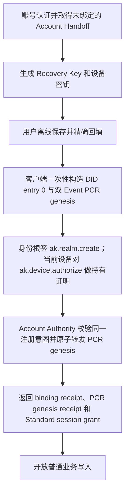

# 用户身份根、设备与恢复流程

> 状态：Inkson 客户端设计说明，非规范正文。协议以
> `arkret-spec/spec/v1/zh/identity/key-management.md` 和
> `crypto-media/device-lifecycle.md` 为准。

## 1. 边界与不变量

- DID 只承载身份根和版本连续性，不承载账号关系、设备目录或业务授权。
- 24 词 Recovery Key 派生身份根、恢复证明与备份 HPKE 三个相互隔离的密钥角色。
- 身份根私钥保持冷存储：不上传、不写入普通设备状态，也不作为日常 Event 签名键。
- 设备签名键是热密钥；session/DPoP 键只绑定会话，不参与身份控制。
- Principal Control Realm（PCR）中的 accepted Event 是设备授权与撤销的唯一业务事实源。

## 2. 首次注册

PCR genesis 固定为两个有序 Event：

1. `ak.realm.create`：由身份根签名，payload 内的 founding device descriptor
   绑定首设备签名键、HPKE 键、算法集合和第二个 Event 的 payload digest；
2. `ak.device.authorize`：`authorization_binding_kind=root_anchored`，
   `authorized_by=principal DID`，并由首设备自身签署持有证明。

首设备无需另一个设备或管理员批准。安全性来自恢复根对创建意图的签名、设备对
私钥的持有证明、双 Event 摘要绑定、Account Handoff 的账号/holder 绑定，以及
服务端原子 acceptance receipt，而不是额外审批。

客户端只持久化公开 draft、幂等键、固定 HLC 和 accepted receipt。崩溃恢复时要求
用户重新输入相同 Recovery Key 并重新派生校验；助记词和派生私钥不得进入普通状态。

## 3. 新设备与设备丢失

- 已有可用设备添加新设备时，当前 accepted 设备签署授权；目标设备只证明持有
  自己的私钥。PCR 写入 `authorization_binding_kind=accepted_device` 的
  `ak.device.authorize`。
- 所有旧设备都不可用时，用户以 Recovery Key 满足已接受 recovery policy，并在同一
  security transaction 中提交 `ak.device.reanchor` 与 replacement
  `ak.device.authorize`。该事务不发布 DID operation；终态 receipt 只绑定 PCR policy/session、
  PCR 当前投影和新设备。
- 如果首次账号注册/DID 创建后、PCR genesis 接受前设备物理损毁，换机后重新认证
  同一账号并提供 Recovery Key；客户端恢复或重建公开 draft，走 PCR-policy
  create-once/re-anchor 路径。不得要求已经损毁的设备批准。
- root recovery completion 后，仍然有效且绑定同一 DPoP holder 的 Account Handoff
  可凭终态 receipt 直接换取 Standard grant；不创建临时受限 grant，也不再次 OIDC。

## 4. 恢复材料与代际围栏

Recovery policy 和加密备份属于 PCR/业务状态，不写入 DID 文档。恢复秘密轮换采用
checkpoint 化事务：先确认新秘密冷保管，再写入新的 policy 与备份 recipient，全部
replacement accepted 后推进 active-series pointer，最后撤销旧 policy key。

每个 durable outbound item 记录当前 accepted device authorization generation。
实际发送前重新查询权威 projection；generation 已替代、设备 revoked/fenced、状态
conflicted 或证据不完整时，在同一次 durable mutation 中 quarantine 当前项及依赖项。
历史上已经被旧设备读取的明文无法通过撤销追回。

## 5. 验收重点

- DID 文档中没有账号权威、设备目录或业务授权条目；
- 首次注册只需账号认证、Recovery Key custody confirmation 和首设备私钥持有证明；
- PCR genesis 的两个 Event 不可拆分、替换键或修改任一摘要；
- 新设备授权严格区分 `pcr_recovery` 与 `accepted_device` 两种证据；
- root recovery receipt、completion attestation、设备/generation 和 session DPoP
  任一不匹配都 fail closed；
- 本地序列化状态中不存在助记词或任何派生私钥。
