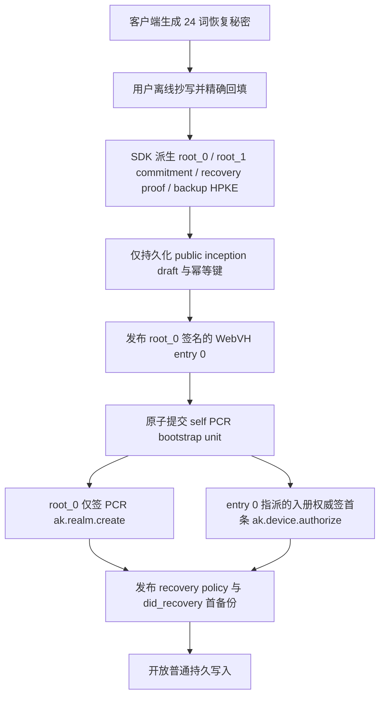

# 用户身份根与恢复流程

> 状态：Inkson 客户端设计说明，非规范正文。协议以
> `arkret-spec/spec/v1/zh/identity/key-management.md`、
> `crypto-media/device-lifecycle.md` 和决策 0010 为准。

## 1. 不变量

- 24 词 Recovery Key 是用户保管的恢复秘密。客户端通过 SDK 的固定
  HKDF-SHA256 密钥计划，分别派生 WebVH 身份根 Ed25519 键、恢复证明
  Ed25519 键和备份 HPKE X25519 键。三个角色不得复用同一物理密钥。
- 身份根私钥从出生即冷：不持久化到普通设备状态，不上传，不成为
  device key，只能签合规 WebVH entry、self PCR genesis、re-anchor 和
  first-backup gate 的离线 receipt。
- 设备签名键是热密钥；入册权威键是只签 `ak.device.authorize` 的温密钥；
  session/DPoP 键不参与身份控制。
- principal entry 0 没有幽灵 `did_public_key`。自主权模型用
  `capabilityDelegation` 指派专用入册键；托管模型用
  `ArkretDeviceEnrollmentAuthority` 指派外部权威 DID。
- A（cross-signing）与 B（外部 enrollment authority）按权威归属互斥。
  自主权模型的 `authority_did == principal DID` 仍归 A，不得误建 B 的
  device-generation 状态机。

## 2. 首次建立身份

关键 gate：

1. 保管确认必须先于 entry 0。待确认期间明文仅在当前 UI 内存中。
2. entry 0 接受后，PCR bootstrap 必须是同一批次的两个 Event；拆批拒绝。
3. `recovery_material_pending` 期间，除上述 bootstrap 例外，普通持久写入
   全部阻断。
4. gate 只有在 accepted recovery policy 和引用该 policy 的可恢复
   `did_recovery` 首 envelope 同时存在时才解除。

崩溃恢复只保存公共 draft、固定 HLC、操作 id 和 accepted evidence。
恢复时要求用户重新提供同一 Recovery Key，重新派生并逐项比对公共承诺；
不保存助记词、root seed、recovery proof seed 或 HPKE 私钥。

## 3. PCR bootstrap 与 managed Agent

self principal 的 bootstrap unit 固定为：

1. `ak.realm.create`：PCR id 从 principal DID 确定性派生，带唯一 critical
   `did_inception` ref，由 entry 0 当前 root 签名；
2. `ak.device.authorize`：`actor_seq=1`，使用 `service_attested` 与
   `enrollment_authority_binding`，由 entry 0 指派的入册权威签名。

managed Agent 不是 self principal。其 PCR 只能走 controller delegation，
必须携带 `executed_by` 与 `authorization_ref`，不得携带 `did_inception`，
不得由 Agent root 走 self-bootstrap 特例。

## 4. 恢复会话矩阵

恢复会话的 identity model 由服务端从 accepted policy snapshot 推导，客户端
请求不携带 `ssk_generation`、model 或 generation 自报字段。proof transcript
绑定 `identity_model` 与 `model_generation_ref`。

| 模型 | 会话快照 | 完成时必须引用 | 禁止 |
| --- | --- | --- | --- |
| A cross-signing | `ssk_generation` | accepted `ak.device.authorize` + `ak.device.list_update` | re-anchor 字段 |
| B enrollment authority | current DID/device generation、registry head、完整 accepted Seal frontier | accepted `ak.device.authorize` + `ak.device.reanchor` + re-anchor batch receipt | list-update 字段、旧代普通写入 |

两种 completion shape 在客户端和 SDK 均为互斥强类型；缺字段、混搭或同时出现
两种状态机时 fail closed。

## 5. B 模型 durable re-anchor / handoff

B 模型恢复或恢复秘密轮换不能包装成一次“更换助记词”。客户端按 checkpoint
依次保存 accepted evidence：

1. 确认新恢复秘密已进入冷保管；
2. 独立入册权威仍可用时，先接受 bridge entry，再接受激活下一代 root 的
   new-root entry；没有独立权威时拒绝原地 handoff，改为重铸 DID；
3. 原子接受 `ak.device.reanchor` 与 replacement `ak.device.authorize`，保存
   accepted-at batch receipt；
4. 接受引用新恢复键角色的 recovery policy；
5. 枚举 `did_recovery`、`secret_storage`、`mls_history` 的每个 active series，
   全部重封装到新 HPKE recipient；
6. 只有全部 replacement 已 accepted，才推进 active-series pointers；
7. 最后撤销旧 policy key，再把 handoff 标记 complete。

任一阶段崩溃都从同一 checkpoint 和幂等键续跑。旧 key 在 pointer 推进前不得
撤销；历史上已被泄露的明文无法通过轮换追回，UI 必须明确这一边界。

## 6. 本地队列的代际围栏

每个 durable outbound item 记录 authoring generation：

- A：SSK generation；
- B：当前 device generation ref，且设备行的 `authorized_generation_ref`
  必须精确等于当前 generation；
- managed Agent：controller generation 与 accepted `authorization_ref` 的
  规范摘要。

每次实际发送前重新查询权威 projection。generation 已被替代、状态 conflicted、
设备不再 active、A/B 状态混杂或 generation 未知时，队列在同一次 durable
mutation 中 quarantine 当前项及依赖项，网络请求不得发出。quarantine 不是
“稍后自动重试”：用户必须重新构造由当前代签名的操作。

已经被旧设备读取或已经到达接收方的历史材料不能被撤销。撤销/恢复只阻止
fence 后的新接纳；被盗设备缓存的密文、密钥或明文应视为已暴露。

## 7. 设置页行为

- 新 Recovery Key 必须先显示、离线保存并精确回填，再发布任何 policy/backup。
- 本地只保存 fingerprint、accepted time 与 HPKE public multikey。
- 已有 active policy 时，输入的 Recovery Key 必须同时匹配 policy 中关联的
  recovery proof key 与 backup HPKE recipient。只匹配其中一个也拒绝。
- 已建立恢复材料后，设置页禁用直接“生成替代 key”；轮换必须进入第 5 节的
  staged handoff。
- passkey 只用于登录，不包装或缓存 Recovery Key，不提供绕过冷保管的快捷解锁。

## 8. 验收重点

- 序列化本地状态中不存在助记词和任何派生私钥；
- entry 0 发布前没有 custody confirmation 就失败；
- self PCR 两槽原子 batch 的错 key、错 ref、拆批和 Agent 混入均失败；
- A/B transcript 与 completion 互斥；
- B handoff 在任一 backup series 未重封装时不能推进 pointer；
- queued old-generation Event 在 submitter 被调用前已 quarantine；
- 已有 policy 与新助记词不匹配时，不会产生错误 recipient 的备份。
