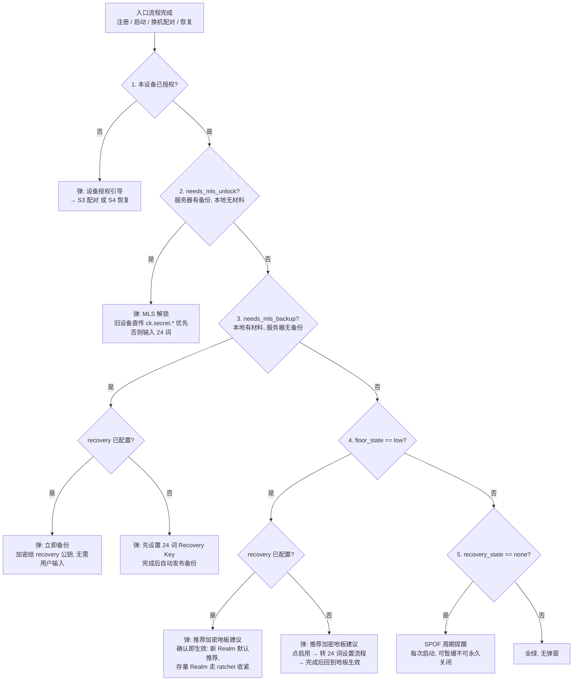
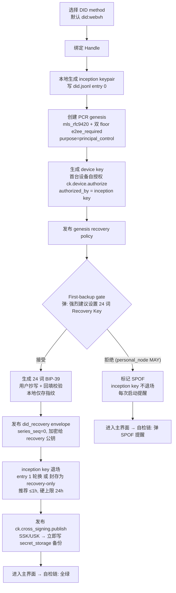
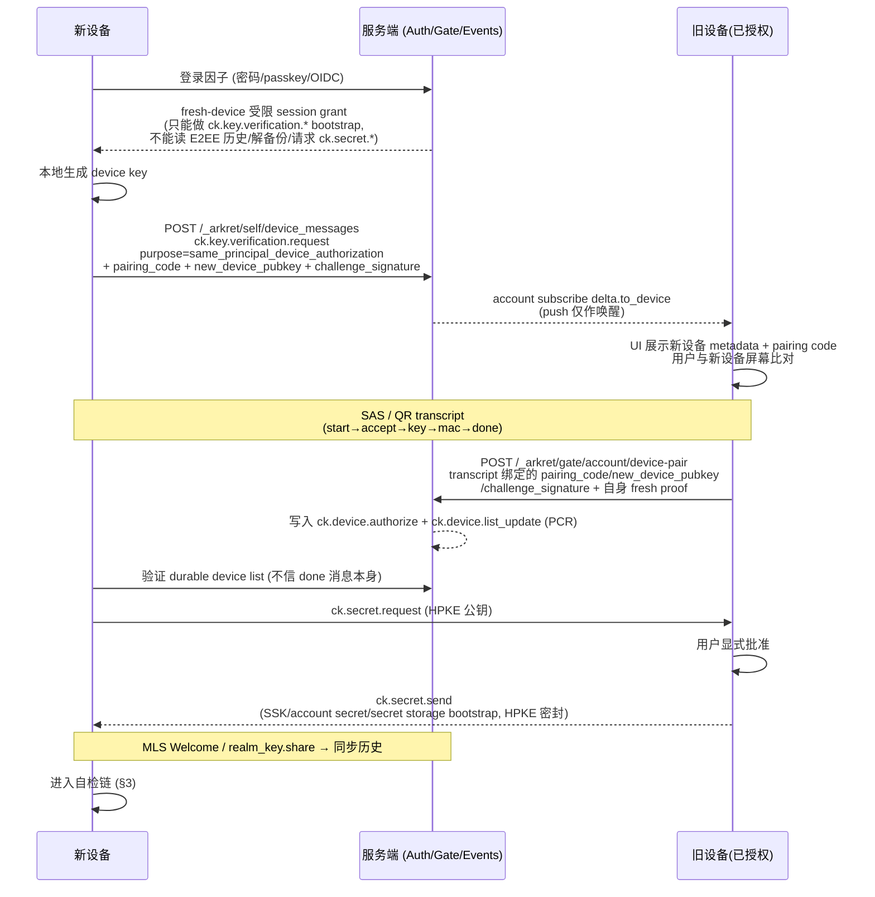
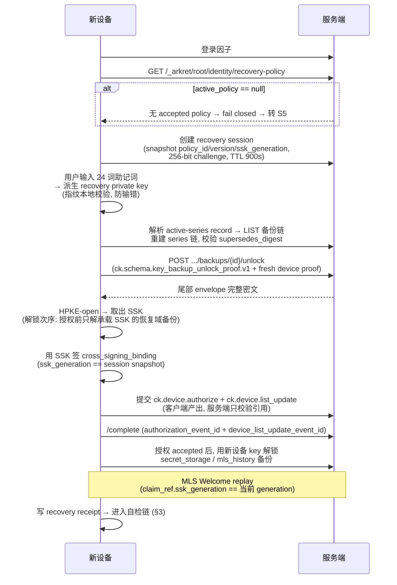
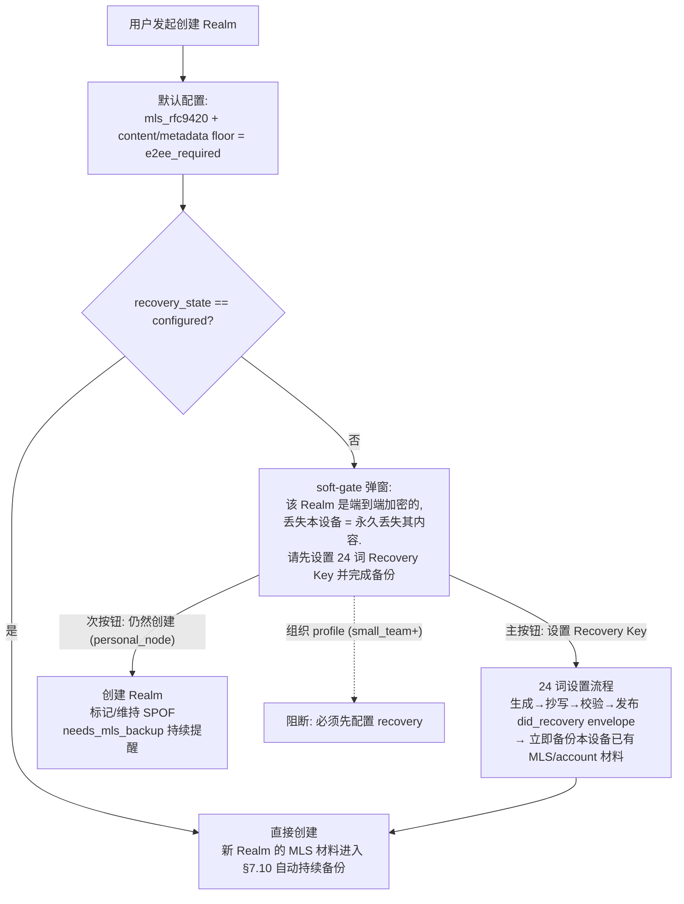

# 用户密钥生命周期流程设计（设备验证 / Recovery Key / PCR 加密 / 备份）

> 状态：设计文档（design，非 normative）。
> 依据：`arkret-spec/spec/v1/zh/identity/key-management.md`（§3.3 / §5 / §7 / §8）、
> `arkret-spec/spec/v1/zh/crypto-media/device-lifecycle.md`（§1.2 / §2 / §10 / §15）、
> `arkret-spec/spec/v1/zh/models/realm-and-space.md`（§2.3 / §2.8.1）。
> 本文描述 inkson 客户端面向最终用户的完整流程编排；协议细节以 spec 为准。
> 配套的 spec 缺口（F1–F6）已于 2026-06-12 全部修复，记录见 `_spec_review/2026-06-12-key-lifecycle-strand-review.md`。
> 关键结论：**PCR 的两条加密 floor 已在协议层（`realm.schema.json` PCR 守卫）钉死为 `e2ee_required`**，
> 因此正确实现下 PCR projection 必然携带达标 floor；"PCR 加密建议"弹窗仅对存量/异常 Realm 生效。

---

## 1. 术语速记

| 术语 | 含义 |
| --- | --- |
| PCR | Principal Control Realm，与 principal DID 1:1 绑定的身份控制流 Realm，`encryption_profile` 固定 `mls_rfc9420`（协议层不存在"未加密的 PCR"）。 |
| Recovery Key | 24 词 BIP-39 助记词，编码 recovery private key 的种子（key-management §3.3）。它同时是 DID 恢复凭证和内容备份的解密凭证（§7.5.2 / §7.7），**不存在独立的 vault 口令**。 |
| 三个备份域 | `did_recovery`（DID 控制链恢复材料）/ `secret_storage`（SSK / USK / account secret）/ `mls_history`（MLS 群组历史密钥）。域间密钥严格隔离（§7.1）。 |
| 登录 / 授权 / 验证 | 三件不同的事（device-lifecycle §1.2）：登录因子只产出短期 session grant；设备授权 = `ck.device.authorize` 落入 PCR，改变设备集合；设备验证 = SAS/QR 人工确认 key，本身不授予任何权力。 |
| First-backup gate | inception key 退场的硬前置：发布 `did_recovery` 域 `series_seq=0` 备份 envelope，或离线 sealed receipt（key-management §5.0.1 step 7）。 |
| SPOF | `single_point_of_failure=true`：personal_node 用户拒绝 first-backup gate 后的账号标记，每次启动提醒。 |
| 推荐加密地板 | `encryption_profile=mls_rfc9420` 且 `content_encryption_floor=e2ee_required` 且 `metadata_encryption_floor=e2ee_required`。floor 是单向 ratchet，只能收紧不能降级。 |

---

## 2. 核心状态变量

所有场景的分支都由这 4 个正交变量决定。任何入口流程（注册 / 启动 / 换机 / 恢复）跑完后都收敛到同一条"账户健康自检链"（§3），由当时的变量值决定弹什么。

| 变量 | 取值 | 判定来源 |
| --- | --- | --- |
| **V1 设备信任** `device_trust` | `first`（首台，inception bootstrap）/ `authorized`（已在设备集合）/ `new_with_peer`（新设备，有可用旧设备）/ `new_no_peer`（新设备，无可用旧设备） | durable device list（PCR 中的 `ck.device.authorize` / `ck.device.list_update`） |
| **V2 恢复配置** `recovery_state` | `configured`（genesis recovery policy accepted + `did_recovery` series_seq=0 存在，或离线 sealed receipt）/ `none`（SPOF） | `GET /_arkret/root/identity/recovery-policy`（`active_policy=null` ⇒ `none`）+ `GET /_arkret/self/keys/backups?backup_class=did_recovery` |
| **V3 E2EE 材料/备份** `e2ee_backup` | `in_sync` / `needs_unlock`（服务器有备份、本地无材料）/ `needs_backup`（本地有材料、服务器无或落后）/ `none`（无任何材料，仅异常存量账号） | 本地 secret storage vs 服务端 backup series |
| **V4 加密地板** `floor_state` | `recommended`（PCR 与全部私有 Realm 达推荐地板）/ `low`（PCR floor 缺失或存在显式低地板的 Realm）/ `unknown`（projection 不足，不弹） | realm projections（PCR 优先，PCR 在视野内时以 PCR 为准） |

`recovery.state.v1` 里的本地指纹只表示"这台设备曾见过一组 24 词"。它不是账号级 recovery configured 证据,也不能替代服务端 active policy 和 `did_recovery` backup。若本地有指纹但服务端 `active_policy=null` 或 `did_recovery` 为空,状态必须按 `none`/incomplete 处理。

关键推论（回答"换机走完会不会弹"这类问题时反复用到）：

- **走 24 词恢复路（S4）的用户，`recovery_state` 必然是 `configured`**——他刚输入了助记词。恢复完成后只可能弹 floor 提示，不会弹"设置助记词"。
- **走旧设备直传路（S3）的用户可能从未设置过助记词**（当初拒绝了 gate）——这是唯一会在换机后出现 `recovery_state=none` 的换机路径。
- **SPOF 账号唯一的换机方式是 S3（旧设备在线确认）**。`active_policy=null` 时 fresh-device recovery 协议层 fail closed（key-management §8）。
- 协议正确实现下，**首注用户永远不会看到"PCR 加密建议"弹窗**：PCR 创建时就以推荐地板落地。该弹窗只是面向存量 / 异常状态的修复入口。

---

## 3. 统一自检链（Account Health Check）

所有入口流程结束后进入同一状态机，按固定优先级逐项检查，**同一时刻最多弹一个**：

设计要点：

- 优先级 1–3 是**功能性阻塞**（不处理就丢数据或用不了 E2EE），4–5 是**建议性**。
- 第 2 步优先旧设备直传（device-lifecycle §10.7 `ck.secret.request/send`，服务端零知识），用户体验上"旧设备点一下确认"优于重新输入 24 词；旧设备不可用才回落到助记词。
- 第 4 步弹窗（即 inkson 的 `EncryptionFloorPrompt`）内嵌第 5 步的依赖：启用推荐加密前必须先有 Recovery Key，否则刚产生的 MLS 材料没有备份归宿。
- `needs_mls_unlock` 与 `needs_mls_backup` 互斥，unlock 优先（先恢复再谈备份）。

---

## 4. 场景总表

| # | 场景 | 入口变量 | 主流程 | 结束后自检链可能弹什么 |
| --- | --- | --- | --- | --- |
| S1 | 首次注册 | `first` | inception bootstrap → PCR genesis（推荐地板）→ 首台自授权 → genesis recovery policy → **first-backup gate（24 词引导）** | 接受 gate：全绿。拒绝 gate：SPOF 提醒（5） |
| S2 | 已授权设备日常启动 | `authorized` | 直接进自检链 | 视 V2–V4 而定 |
| S3 | 换设备・旧设备在线 | `new_with_peer` | 登录因子 → 受限 session → QR/SAS 验证 → 旧设备批准 → gate device-pair → 授权 → secret 直传 + Welcome | floor 低 → 弹（4）；助记词未设 → （4）内转 24 词设置，或（5） |
| S4 | 换设备・无旧设备・有 24 词 | `new_no_peer` + `configured` | recovery session → 输入 24 词 → 解锁备份取 SSK → 客户端自签授权 → 解锁其余备份 → Welcome replay → receipt | 只可能弹 floor（4），不会弹助记词设置 |
| S5 | 换设备・无旧设备・无 24 词 | `new_no_peer` + `none` | **协议层 fail closed**。只能：受限登录（无 E2EE）/ 等旧设备转 S3 / cross-signing reset + 身份重建（历史不可恢复） | 持续显示"无恢复路径"警告 |
| S6 | 创建新加密 Realm | `authorized` | 默认 `mls_rfc9420` + 双 floor `e2ee_required`；创建前检查 V2 | `recovery=none` → **soft-gate**：先引导设置 24 词并备份，可显式跳过（标 SPOF） |
| S7 | 旧设备撤销 / 泄露响应 | `authorized` | `ck.device.revoke` → MLS Remove 推进 epoch → 受影响备份开新 series → 确认新备份可恢复后删旧 series | 备份轮换期间弹（3） |

---

## 5. S1 首次注册并进入 inkson

要点：

1. **PCR 创建即推荐地板，不询问用户**。"是否加密 PCR"不是用户决策——协议固定 `mls_rfc9420`，inkson 在 genesis 时同时把双 floor 写成 `e2ee_required`。首注用户因此永远见不到加密建议弹窗。
2. **"强烈建议加密"在首注流程的真实形态是 first-backup gate**：因为 PCR 本身就是 MLS Realm，注册完成即产生了 E2EE 材料，材料需要备份归宿，备份归宿需要 Recovery Key——所以 24 词设置被编排成注册主线的一步，而不是事后建议。
3. 拒绝分支的代价要明示：SPOF 账号丢失唯一设备 = 永久丢失账号控制与全部 E2EE 历史；且 inception key 24h 窗口过期后只能由 device key 承担日常授权。
4. gate 失败（网络等）时 MUST 阻止 inception 退场，不得静默销毁 inception key。

---

## 6. S3 换设备登录：旧设备验证（推荐路径）

要点：

1. **验证收敛到两台具体设备**；其他收到 request 的设备收到 `cancel(accepted_by_other_device)`。请求 10 分钟硬过期。
2. SAS 成功 ≠ 授权。授权唯一落点是 gate 的 `device-pair`，由旧设备提交。
3. secret 直传必须在 SAS 验证**之后**，且与 transcript 绑定的设备一致（防"验证 A 发给 B"），旧设备用户须显式批准。
4. 用户没有任何可用旧设备时，UI 先明确提示"在已有设备确认"，确认不可用后才进入 S4/S5。

### 6.1 换机完成后的弹窗矩阵（floor × recovery 四象限）

| | `recovery=configured` | `recovery=none`（当初拒绝 gate） |
| --- | --- | --- |
| **floor 达标** | 全绿，无弹窗 | 弹 SPOF / Recovery Key 设置提醒（自检链第 5 步） |
| **floor 低** | 弹加密地板建议；确认后直接生效 | 弹加密地板建议；点"启用"→ **先**进入 24 词设置流程 → 完成（含 first-backup 等价补课：发布 `did_recovery` envelope + 立即备份已有材料）→ 回到地板生效 |

即：换机走 S3 之后**可能**出现"发现 PCR/Realm 地板不达标 → 弹加密建议 → 此时助记词可能已设（直接确认）也可能没设（先引导设置）"——两种都被自检链覆盖，顺序确定。

---

## 7. S4 换设备登录：24 词恢复（无可用旧设备）

要点：

1. UI 在解密任何 envelope 前必须展示 `backup_class` / `series_id` / `series_seq` / `recipient_method` / `principal_id` / 新设备 `device_id` 等（key-management §7.7），并拒绝禁用证明类型（历史明文、邮箱验证码、已撤销设备 key）。
2. 恢复用链的**最尾** envelope；任何断链 → `series_chain_broken`，frontier 过期 → `backup_frontier_stale`，一律 fail closed 并向用户解释。
3. secret storage 解锁、device list 同步、关键 Realm Welcome 完成前，设备只显示 `recovery_pending`，不得显示为 fully verified。
4. 该路径完成后 `recovery_state` 必然 `configured`，自检链最多弹 floor 建议。
5. SSK 恢复来源的备份域归属在 spec 中有一处矛盾（§7.1 vs device-lifecycle §15 step 3/4），实现前需 spec 裁决——见 `_spec_review` F3。

---

## 8. S5 兜底：无旧设备且无 Recovery Key

协议层没有再恢复 E2EE 的路径，UI 必须诚实：

1. 允许受限登录（短期 session grant），**无 E2EE 历史、无 secret storage**。
2. 提供三个出口，按优先级展示：
   - "找回任何一台旧设备" → 转 S3；
   - "找到你的 24 词助记词 / 离线 sealed receipt" → 转 S4；
   - "放弃加密历史，重建身份" → cross-signing reset（需 §14 高风险证明之一；SPOF 账号若连 principal signing key 也不可用，则只剩 deactivate + 新 DID 身份重建）。
3. 明示不可挽回边界："重建后旧的加密消息永远无法解密；联系人需要重新验证你的身份。"

---

## 9. S6 创建新 Realm（默认加密）

要点：

1. 创建加密 Realm 是除注册外**第二个产生新 MLS 材料的时点**，因此是第二个 Recovery Key 强引导时点。
2. personal_node 用 soft-gate（可跳过但持续追讨），组织 profile 建议硬性阻断——此前置门 spec 尚未规定，已提案（`_spec_review` F4）。
3. Realm 一旦以 `e2ee_required` 创建，floor 是单向 ratchet，不可降级；低地板存量 Realm 只能收紧不能"重建为加密"。
4. 用户在 gate 内完成 24 词设置后应**无缝回到创建流程**，不要让用户重新填一遍 Realm 表单。

---

## 10. 与 inkson 现有实现的对照（含本轮改动）

### 10.1 新抽象：`account_health` 统一自检链解析器

本轮把"哪个弹窗该显示"从各组件内联的 suppression 条件，收敛到单一纯函数 `src/account_health.rs`：

- `AccountHealthPrompt` 枚举按声明顺序即优先级（derive `Ord`）：`DeviceAuthorization` → `MlsUnlock` → `MlsBackup` → `RecoverySetupMissing` → `RecommendedEncryptionFloor` → `RecoverySetupReminder` → `None`。
- `AccountHealthInputs`（纯 bool 输入）+ `resolve()` 返回当前唯一应显示的弹窗。功能性弹窗（device/unlock/backup/recovery-missing）不等 sync；建议性弹窗（floor/SPOF）等 `sync_bootstrap_complete` 且避开 recovery 路由。
- `app.rs` 每次渲染从现有 signals 采样一次 `active_prompt`，每个弹窗 `if active_prompt == X` 才挂载。**这替代了原先散落且漂移的内联条件**（旧实现里 floor 模态会对 unlock/backup 自抑制，却不抑制 S5 banner；SPOF banner 完全不抑制 unlock/backup，导致多 banner 叠加）。
- 14 条单测覆盖全部优先级与门控（`cargo test --lib -- account_health`）。

### 10.2 对照表

| 设计点 | 状态 | 说明 |
| --- | --- | --- |
| 自检链优先级 1–5 | ✅ 已重构 | 统一到 `account_health::resolve`；§3 的五级链 + 单弹窗互斥落地，SPOF 提醒（第 5 步）也纳入解析器（`RecoverySetupReminder`） |
| S1 first-backup gate | ✅ 已有（既存） | `onboarding.rs` `FirstBackupGate` 硬门禁；拒绝分支的 SPOF 标记 + 启动提醒仍可加强 |
| S3 配对 | ◑ 既存框架 | `settings/devices.rs` QR/pairing-code/gate device-pair 完整；SAS transcript 与 `ck.secret.*` 直传端到端联动待补 |
| S4 恢复 | ◑ 既存框架 | `recovery.rs` 24 词输入与备份解锁已有；`recovery_session` 协议闭环（challenge/proof/complete/receipt）待接 |
| S6 创建前检查 | ✅ 本轮新增 | `setup.rs` 创建按钮新增 recovery soft-gate：加密 Realm + 未配置 recovery → 弹门，"设置 Recovery Key"（转 `SettingsRecovery`）或 "Create without recovery"（personal_node override，置 `recovery_gate_acknowledged`） |
| PCR floor 协议固定 | ✅ 本轮（spec） | `realm.schema.json` PCR 守卫钉死双 floor；`EncryptionFloorPrompt` 对正确实现的 PCR 不再误弹 |
| `recovery_options_configured` | ✅ 本轮修正 | 以服务端 `active_policy` + `did_recovery` series 为真相；本地 `recovery_key_fingerprint` 只做本设备缓存/显示,不得单独判账号 configured |

图例：✅ 已落地 ／ ◑ 既存框架但有缺口 ／ ❌ 缺失。

### 10.3 E2E 测试覆盖（`inkson/tests/e2e/inkson.strands.spec.ts`）

本轮按新流程逻辑更新并新增 Playwright e2e（对 mock soland），全部通过：

| 测试 | 覆盖 |
| --- | --- |
| `first authenticated session surfaces a single recovery prompt by priority` | 单弹窗优先级：RecoverySetupMissing 抢占 → 关闭后才显示低优先级的 recovery-setup banner（替代原 multi-prompt 断言） |
| `fresh browser requires device authorization before recovery or encryption prompts` | 优先级 1：设备授权抢占 floor / recovery 弹窗 |
| `encrypted Realm creation without recovery is gated, then proceeds on override` | **S6 gate**：未配置 recovery 创建加密 Realm → 弹门、阻断 create；override 后再次 create 才提交 |
| `encrypted Realm backup uses existing Recovery Key …` | 已配置 recovery 时 gate 被绕过（`toHaveCount(0)`），走 existing-key 备份分支 |
| `mls recovery backup generates 24 recovery words` | gate override 后进入备份流程，生成 24 词 |
| `setup, onboarding, and space timeline strand works` | 端到端冒烟（注册→建 Realm 经 gate→备份→时间线发消息） |

同时修复了 `cotest/e2e/helpers/users.ts` 的 `createRealm` helper，使其对加密 Realm 的 S6 gate 做 override，覆盖所有 cotest 场景的建 Realm 路径。

> 注：上述前 5 项中的 508/548 等建 Realm 测试在改动前即因 mock 默认弹出的 recovery-missing 阻断而失败（已用 parent-commit A/B 确认为既有失败），本轮一并修正（导航后 dismiss 阻断弹窗、seed 用 `addInitScript` 持久化）。`account_health` 解析器另有 14 条 Rust 单测（`cargo test --lib -- account_health`）。

---

## 11. 自查记录

- [x] 4 个变量两两正交，每个场景可由变量值唯一定位；S1–S7 覆盖 `device_trust` 全部取值 × `recovery_state` 两值的可达组合（`first×none` = S1 拒绝分支；`new_no_peer×none` = S5）。
- [x] "PCR 没加密"在协议层不可能（receiver MUST reject），用户语境下的真实含义是 **floor 不达标**——已在 §1/§5 澄清，弹窗语义统一为"推荐加密地板"。
- [x] 两个"必须设助记词"的强时点（注册 first-backup gate、首次创建加密 Realm）+ 两个"建议"时点（floor 启用、SPOF 提醒）互不冲突，全部收敛到同一个 24 词设置流程。
- [x] S4 完成后不可能弹"设置助记词"（用户刚输入过）；S3 完成后可能弹——四象限表（§6.1）闭合。
- [x] 与 spec 的冲突点（PCR floor 未固定、history_visibility 不一致、SSK 域归属矛盾、Realm 创建前置门缺失）已全部修复，见 `_spec_review/2026-06-12-key-lifecycle-strand-review.md` 处置表（F1–F6 resolved，lint 通过）。
- [x] inkson 侧本轮改动：新增 `account_health` 统一解析器（替代散落 suppression）+ S6 加密 Realm 创建 recovery soft-gate；`cargo check --lib` 与 `cargo test --lib -- account_health encryption_floor_prompt`（22 通过）均绿，未引入新 warning。
